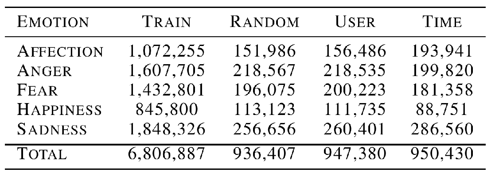
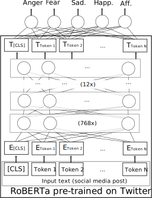
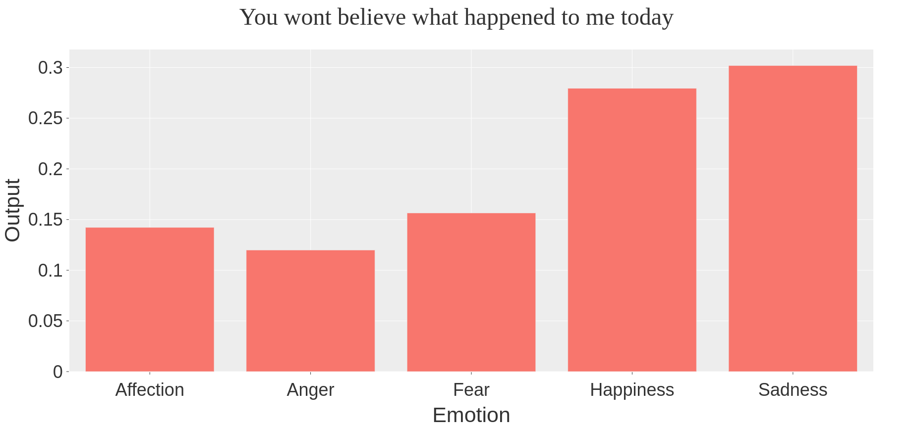
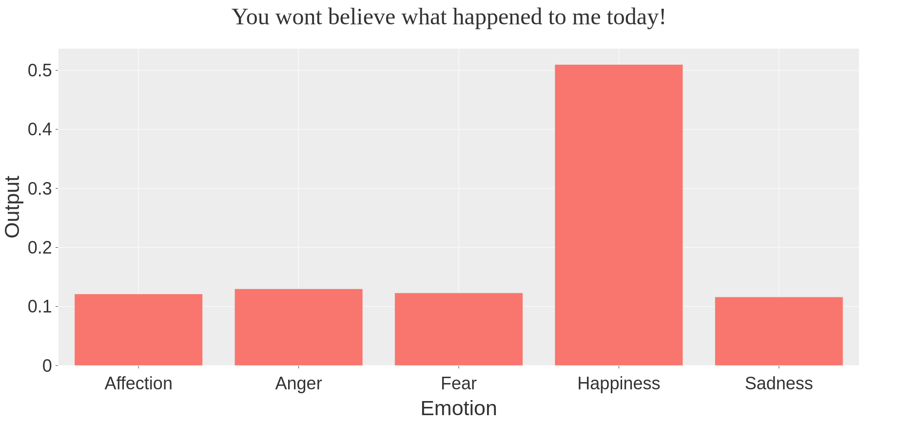
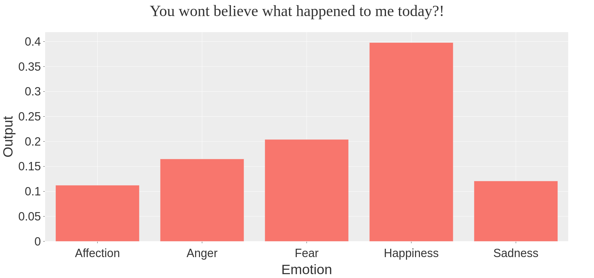
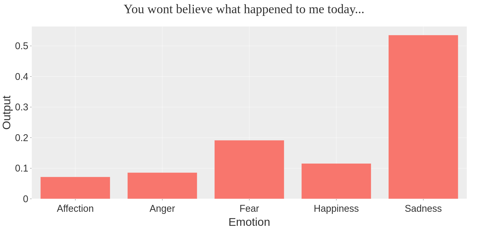
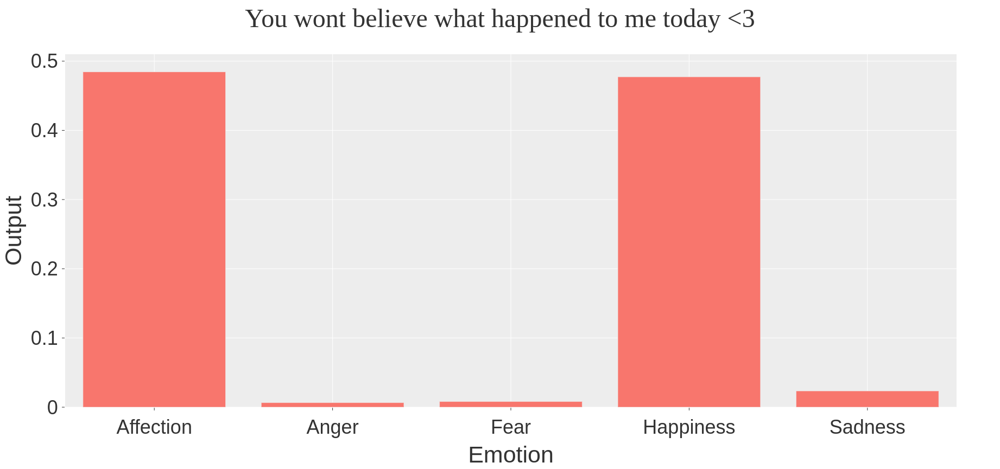

```{r xaringan-themer, include=FALSE, warning=FALSE}
#This block contains the theme configuration for the CSS lab slides style
library(xaringanthemer)
library(showtext)
style_mono_accent(
  base_color = "#5c5c5c",
  text_font_size = "1.5rem",
  header_font_google = google_font("Arial"),
  text_font_google   = google_font("Arial", "300", "300i"),
  code_font_google   = google_font("Fira Mono")
)
```

```{r setup, include=FALSE}
options(htmltools.dir.version = FALSE)
```


layout: true
<div class="my-footer"><span>David Garcia - Inaugural Lecture</span></div> 

---

background-image: url(figures/AboutUS.svg)
background-size: 98%

---

<center>
```{r, echo=FALSE, out.width=900}
knitr::include_graphics("figures/CSSinfo.png")
```
### Aim: understanding human behavior and socio-technical phenomena in the digital society

---

# Outline

</br>

## 1. Methodological Deficits in CSS

## 2. Social Media Macroscopes of Emotions

## 3. Detecting Individual Emotions in Social Media

---
## The Hype Cycle of Computational Social Science
<center>
```{r, echo=FALSE, out.width=900}

```

---

## The Hype Cycle of Computational Social Science
<center>
```{r, echo=FALSE, out.width=900}
knitr::include_graphics("figures/Hype3.svg")
```
---
background-image: url(figures/VennV2-1.svg)
background-size: 97%
---
background-image: url(figures/VennV2.svg)
background-size: 97%
---

# Social Media Macroscopes of Emotions

</br>

## 1. Introduction to Computational Social Science

## *2. Social Media Macroscopes of Emotions*

## 3. Detecting Individual Emotions in Social Media

---


# Social Media Macroscopes

```{r, echo=FALSE, out.width=800, fig.align='center'}

```

---

layout: true
<div class="my-footer"><span>
<a href=https://arxiv.org/abs/2107.13236> Social media emotion macroscopes reflect emotional experiences in society at large. David Garcia, Max Pellert, Jana Lasser, Hannah Metzler. https://arxiv.org/abs/2107.13236 (2021)</a></span></div>

---

# Social Media Macroscopes of Emotions

.pull-left[
```{r, echo=FALSE, out.width=500}
knitr::include_graphics("figures/Paris.png")
``` 
]

.pull-right[
Concerns about macroscopes:
1. Representation issues

2. Performative behavior

3. Measurement error and bias

4. Researcher degrees of freedom
]

*Collective Emotions and Social Resilience in the Digital Traces After a Terrorist Attack. Garcia & Rimé, Psychological Science (2019)*

---


## Limits of Social Media Data to Study Emotion

```{r, echo=FALSE, out.width=1100}
knitr::include_graphics("figures/Jaidka.png")
```

[Estimating geographic subjective well-being from Twitter: A comparison of dictionary and data-driven language methods. Jaidka et al. PNAS (2020)](https://www.pnas.org/content/117/19/10165.short)

---

# Validating a UK emotion macroscope

```{r, echo=FALSE, out.width=975, fig.align='center'}

```

---

# Sadness in Twitter and YouGov

```{r, echo=FALSE, out.width=1200, fig.align='center'}
knitr::include_graphics("figures/Sadness.svg")
```

- Similar results with dictionary-based and supervised methods (r~0.65)
---
# Anxiety in Twitter and YouGov

```{r, echo=FALSE, out.width=1200, fig.align='center'}

```

- Improvement thanks to gender information in tweets

---
# Joy in Twitter and YouGov

```{r, echo=FALSE, out.width=1200, fig.align='center'}
knitr::include_graphics("figures/Joy.svg")
```

- Good correlation with supervised method but no correlation with dictionary-based method

---

layout: true
<div class="my-footer"><span>
Validating daily social media macroscopes of emotions. Max Pellert, Hannah Metzler, Michael Matzenberger, David Garcia. https://arxiv.org/abs/2108.07646 (2021)</span></div>

---

## Study 2: Validating an Austrian macroscope

.pull-left[

- 20-day emotion survey in derstandard.at (N=268,128)
- Daily frequency, 3-day windows

- Text from Der Standard forum (N=452,013)

- Austrian tweets (N=515,187) filtered as UK macroscope

- Compared dictionary-based (LIWC) and supervised model (GS)

]
.pull-right[
```{r, echo=FALSE, out.width=800}
knitr::include_graphics("figures/DS1.svg")
```
]

---

## Twitter sentiment and Der Standard survey

```{r, echo=FALSE, out.width=1000, fig.align='center'}
knitr::include_graphics("figures/DS2.svg")
```

---

# Correlations with new COVID-19 cases

.pull-left[
```{r, echo=FALSE, out.width=600}
knitr::include_graphics("figures/DS31.svg")
```
]
.pull-right[
```{r, echo=FALSE, out.width=600}
knitr::include_graphics("figures/DS32.svg")
```
]

- Do correlations attenuate due to additional social media measurement error?
- Survey emotion correlation with new cases as strong as Twitter sentiment
- Errors sources might be different: Need for conceptual validations

---

## Online Media for Social Sensing of Emotions

```{r, echo=FALSE, out.width=850, fig.align='center'}
knitr::include_graphics("figures/socialsensing.svg")
```

---

## Social media macroscopes: Take-home message


```{r, echo=FALSE, out.width=250, fig.align='center'}

```

**Despite important concerns about Computational Social Science methods in terms of representativity and online behavior, social media macroscopes of emotion can substantially agree with established social science methods**

<a href=https://arxiv.org/abs/2107.13236> Social media emotion macroscopes reflect emotional experiences in society at large. David Garcia, Max Pellert, Jana Lasser, Hannah Metzler. https://arxiv.org/abs/2107.13236 (2021)
---

layout: true
<div class="my-footer"><span>LEIA: Language Embeddings for the Identification of Affect. David Garcia, Lukas Malik, Nikolas Haimerl, Alina Herderich, Max Pellert, Anna Di Natale, Hannah Metzler</span></div> 

---


# Detecting Emotions in Social Media

</br>

## 1. Introduction to Computational Social Science

## 2. Social Media Macroscopes of Emotions

## *3. Detecting Individual Emotions in Social Media*

---

## Challenges in individual emotion detection

**The problem of sentiment analysis: Writer versus reader emotions**

```{r, echo=FALSE, out.width=950, fig.align='center'}

```

Current sentiment analysis approaches assume that the **ground truth** is an annotation of emotions by **a reader**, often a student or a crowdsourcing worker

---

## LEIA: Training with self-reported emotion labels

.pull-left[


- LEIA: Language Embeddings for the Identification of Affect

- Trained with 6.8M self-annotated Vent posts

- Testing strategy: random vents, random users, last 10% of time

```{r, echo=FALSE, out.width=500}

```
]

.pull-right[
```{r, echo=FALSE, out.width=350, fig.align='center'}

```
]

---

# LEIA vs other methods: $F_1$ scores

| Test | TF-IDF SVM | FastText  | LEIA |
| --- | --- | --- | --- |
| Random | $53.3 [53.2, 53.4]$ | $62.5  [62.4, 62.6]$ | $\textbf{70.8 [70.7, 70.9]}$ |
| Users | $53.3 [53.2, 53.4]$ | $60.6 [60.5, 60.7]$ | $\textbf{69.0 [68.9, 69.0]}$|
| Time | $54.7 [54.6, 54.8]$ | $61.6 [61.5, 61.7]$ | $\textbf{69.7 [69.6, 69.8]}$ |

- LEIA outperforms typical text modelling approaches in all three tests
- $F_1$ scores very slightly lower in user and time test versus random test
- Performance mostly homogeneous across emotions

| Anger | Fear | Affection | Happiness | Sadness |
| --- | --- | --- | --- | --- |
| $\small 71.6 [71.4, 71.7]$ | $\small 67.8 [67.6, 68.0]$ |  $\small 73.0 [72.8, 73.1]$ | $\small  72.5 [72.3, 72.7]$ | $\small  70.3 [70.1, 70.4]$ |
  
  
---
# Classification examples

.center[]

---

# Classification examples

.center[]

---

# Classification examples

.center[]

---

# Classification examples

.center[]

---

# Classification examples

.center[]

---


## LEIA outperforms crowdworking annotators
| Emotion | LEIA  $F_1$ | Indiv. Rater  $F_1$ | Majority Vote  $F_1$ |
| --- | --- | --- | --- |
| Affection  | **70.5  [64.2, 76.8]** |  41.0 [36.0, 46.2] | 53.5  [46.6, 60.5] |
| Anger | **68.0 [61.3, 74.4]** | 40.0  [34.7, 45.3]  |  34.4 [28.0, 41.1] |
| Fear | **65.5 [58.7, 72.0]** | 33.1 [28.3, 38.0] | 41.5  [34.7, 48.3] |
| Happiness  | **81.1 [75.3, 86.2]** | 63.2  [57.7, 68.5] | 65.5 [58.8, 72.1] |
| Sadness | **65.0 [58.3, 71.5]** | 49.0 [43.7, 54.1] | 47.0  [40.0, 53.9] |
| Average | **70.0 [67.2, 72.8]** | 45.2 [42.9, 47.6] | 48.4  [45.3, 51.5] |

- Amazon Mechanical Turk annotators recruited with </br>high approval rate in the US (pay ~ 11$/h)
- McNemar test of LEIA vs majority vote ( $\chi^2=74$, p<0.001)
- **Follow up:** testing versus native-speaking psychology students


---

# Transfer evaluation with ISEAR task

- International Survey on Emotion Antecedents and Reactions
- Developed to measure *emotion recognition ability* 
- Fear example: *"When I was involved in a traffic accident"*
- Joy example: *"When I got a letter offering me the Summer job that I had applied for"*
- **Follow up:** get own annotator values of $F_1$ for ISEAR

LEIA $F_1$ versus ISEAR emotion labels:

| Joy | Fear | Anger | Sadness |
| --- | --- | --- | --- |
| $86.3[82.0, 89.8]$ | $76.2[71.4, 80.5]$ | $77.4 [73.0, 81.4]$ | $73.2[68.1, 77.6]$ |

** Superhuman Artificial Affective Intelligence: Initial results suggest that LEIA outperforms humans in emotion detection from social media text **

---

# Summary

- **Computational Social Science**
  - Analyzing human behavior and socio-technical phenomena with digital trace data and computational methods
  - Need for focus on methods validation and comparison
  
  
- **Social Media Macroscopes of Emotions**
  - Macroscopes of emotions in the UK agree with survey data
  - Replication in Austria in Der Standard


- **Detecting Individual Emotions from Social Media Text**
  - LEIA as an approach to estimate self-labelled emotions
  - Initial results outperform human raters in crowdworking platforms

.center[**More at: [www.dgarcia.eu](https://dgarcia.eu) and [@dgarcia_eu](https://twitter.com/dgarcia_eu)**  
**Thanks for listening!**
]
